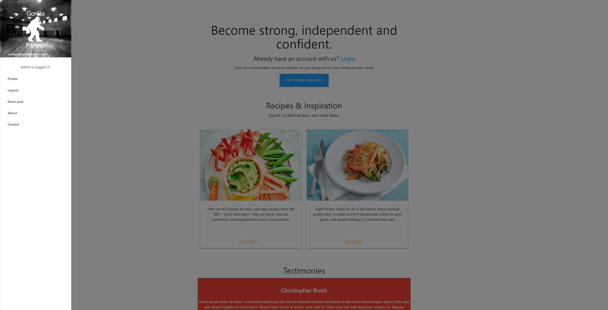
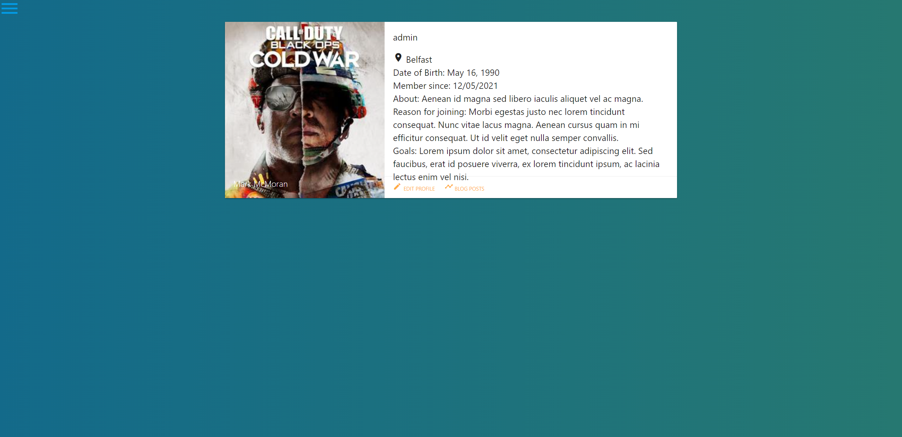

##  Gorilla Fitness

### Quick summary of the project
A web application inspired by [My Fitness Pal](https://www.myfitnesspal.com/).

You have your own profile that you can create, and update:

Modifying your profile

## To get up and running on local machine

### Install Python >=3.6
Refer to their documentation on how to install if you don't have it installed yet.  Otherwise, skip this step.
[Download page](https://www.python.org/downloads/), select your version for your OS.

######  Install requirements for project
    pip install -r requirements.txt

#### Run the following to get up and running:

    python manage.py runserver

##Tech stack
#####Base line technologies

- Python
- MySQL

#####APIs used in the project
- Materialize CSS framework
- Django 3.0.6

### Contributors
- Mark McMoran
